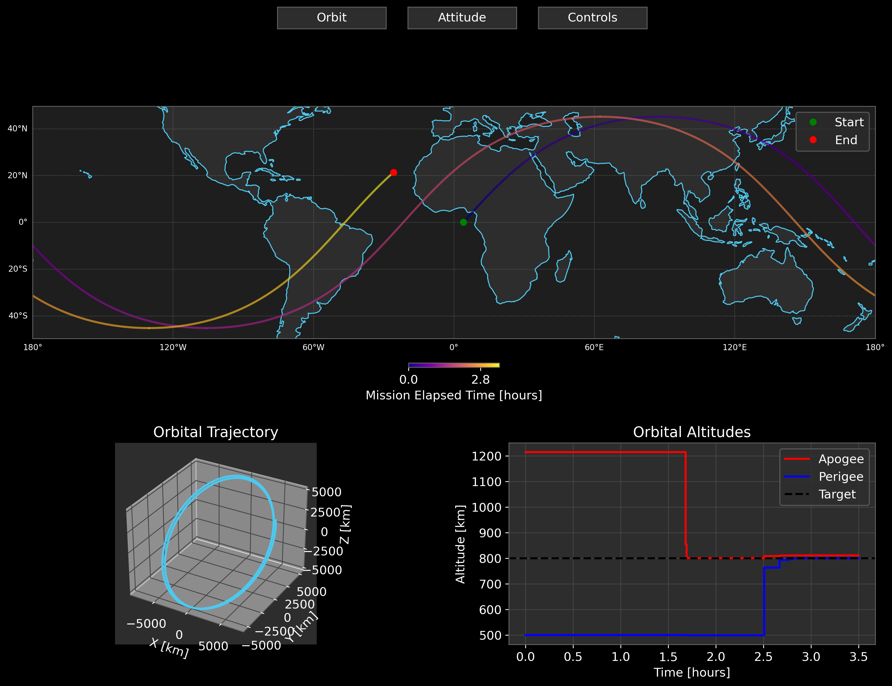

<div align="center">
  
</div>

This repo will serve as a test bed for simulating interesting Near-Earth satellite and space station flight concepts from a guidance and controls perspective.

<div align="center">

[](https://en.cppreference.com/w/cpp/17)
[](https://cmake.org/)
[](LICENSE)
[](https://github.com/Natsoulas/Earthbound)

</div>

## Overview
At the moment, this simulation implements a basic satellite dynamics model in Low Earth Orbit (LEO), including:

- Full 6-DOF rigid body dynamics
- Quaternion-based attitude representation (inertial to body frame quaternion that evolves with inertial trajectory)
- Coordinate frame transformations between:
  - GCRS (Geocentric Celestial Reference System) - An inertial frame aligned with the Earth's equator, ideal for LEO satellite navigation
  - ITRS (International Terrestrial Reference System) - Earth-fixed frame, also known as ECEF
  - LLA (Latitude, Longitude, Altitude) coordinates

The GCRS frame serves as our primary inertial reference frame (equivalent to ECI for most applications), with its xy-plane aligned with the Earth's equator. This makes it particularly well-suited for LEO satellite applications since most orbital perturbations are symmetric about the equator.

## Dependencies

<div align="center">

| Core Dependencies | Version | Description |
|------------------|---------|-------------|
|  | 17+ | Core language |
|  | 3.10+ | Build system |
|  | 3.x | Linear algebra (included as submodule) |
|  | Latest | Astronomy routines |
|  | Latest | Testing framework |

</div>

### Platform-Specific Setup
<details>
<summary>macOS</summary>

```bash
brew install cmake googletest
```
</details>

<details>
<summary>Linux (Ubuntu/Debian)</summary>

```bash
sudo apt-get install cmake libgtest-dev
```
</details>

<details>
<summary>Windows</summary>

1. Install [CMake](https://cmake.org/download/)
2. Install [Google Test](https://github.com/google/googletest/releases)
3. Install Visual Studio with C++ development tools
</details>

## Visualization

<div align="center">

| Python Dependencies | Version |
|--------------------|---------|
|  | 3.7+ |
|  | Latest |
|  | Latest |
|  | Latest |
|  | Latest |

</div>

## Building and Running

1. Clone the repository and initialize submodules:

```bash
git clone https://github.com/Natsoulas/Earthbound.git
cd Earthbound
git submodule update --init --recursive
```

2. Create and enter build directory:

```bash
mkdir build && cd build
```

3. Configure and build the project:

#### macOS/Linux
```bash
cmake ..
make
```

#### Windows (using Visual Studio)
```bash
cmake -G "Visual Studio 17 2022" ..
cmake --build . --config Release
```

4. Run the simulation:

#### macOS/Linux
```bash
./Earthbound
```

#### Windows
```bash
.\Release\Earthbound.exe
```

This will generate output files in the `output` directory containing the simulation results.

## Running Tests

The project uses Google Test for unit testing. To run the tests:

1. Build the tests (they are built automatically with the main project):

```bash
cmake ..
make
```

2. Run all tests:

#### macOS/Linux
```bash
./bin/unit_tests
```

#### Windows
```bash
.\bin\Release\unit_tests.exe
```

Individual test suites can be run using Google Test filters:

```bash
./bin/unit_tests --gtest_filter=TestSuiteName.TestName  # macOS/Linux
.\bin\Release\unit_tests.exe --gtest_filter=TestSuiteName.TestName  # Windows
```

## Visualization

To visualize the simulation results:

1. Install the required Python packages:

```bash
pip install numpy pandas matplotlib cartopy
```

2. Run the visualization script:

```bash
python viz/plotMissionDashboard.py
```

This will generate several plots:
- Orbital trajectory in 3D
- Ground track overlaid on a map
- Time history of key state variables
- Attitude quaternion evolution

The plots will be saved in the `plots` directory by default.

### Example Dashboard


## Configuration

Simulation parameters can be modified in the `include/config/simpleSat.hpp` file, including:
- Initial orbital elements
- Simulation duration and time step
- Spacecraft physical properties
- Output file settings
